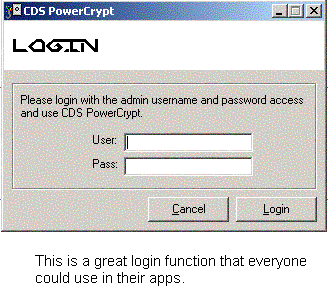



## CDS PowerCrypt \(High Power Encryption\)

### Description

The encryption methods used in this program are probably some of the best available for Visual Basic. There are about 7 different methods of encryption featured in this program. For example, Skipjack, CryptAPI, Blowfish, and more. I adapted the main design of the program from another program. So you may see similarities in code and looks. But hey, thats what PSC is. Just a way to share code and adapt that code for your own personal use. I threw on a login feature to make it more secure so people cant go around encrypting and decrypting stuff on your PC. It's a simple, yet smart login feature than anyone could use in their programs. Please vote, leave comments, and enjoy the code! If you like this, please email me and tell me and I might make more versions of it. Thanks!!
 
### More Info
 
Don't encrypt stuff required by Windows :). You never know what'll happen.

             |
---                |---
**Submitted On**   |2003-10-11 16:52:08
**By**             |[Conard Data Systems](https://github.com/Planet-Source-Code/PSCIndex/blob/master/ByAuthor/conard-data-systems.md)
**Level**          |Intermediate
**User Rating**    |4.0 (16 globes from 4 users)
**Compatibility**  |VB 5\.0, VB 6\.0
**Category**       |[Encryption](https://github.com/Planet-Source-Code/PSCIndex/blob/master/ByCategory/encryption__1-48.md)
**World**          |[Visual Basic](https://github.com/Planet-Source-Code/PSCIndex/blob/master/ByWorld/visual-basic.md)
**Archive File**   |[CDS\_PowerC16572110112003\.zip](https://github.com/Planet-Source-Code/conard-data-systems-cds-powercrypt-high-power-encryption__1-49180/archive/master.zip)

